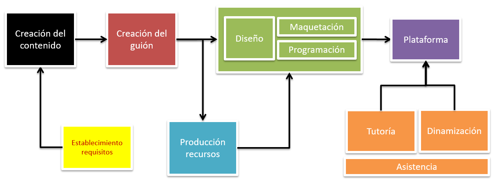

En el apartdo de metodología encontrarás consejos y trucos para desarrollar contenidos e-learning. Las ideas que compartimos están basadas en nuestra experiencia y no pretenden ser exclusivas ni las únicas. Son válidas tanto si utilizas haztivity para desarrollar un contenido e-learning como si utilizas cualquier otra herramienta.

En el desarrollo de un contenido e-learning están implicados diferentes perfiles: creador de contenidos, creador del guión, diseñador, maquetador, programador. Una sola persona puede desarrollar los 5 roles o cada uno de los roles puede, a su vez, dividirse para buscar una mayor especialización.

En este apartado de metodología, recogemos las principales ideas a tener en cuenta, desde nuestra visión, para desarrollar un contenido e-learning.

<!--
[link](#Titulo-1-1)
-->