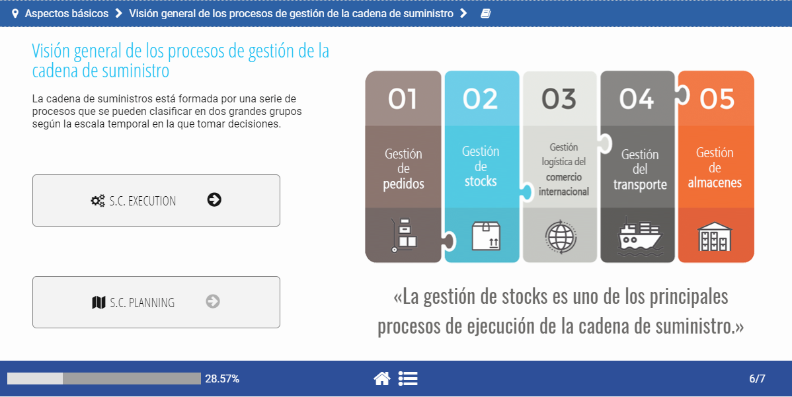

Un curso e-learning es un cuerpo de contenidos que se van mostrando al usuario de manera secuencial a través de acciones que va realizando. Los contenidos se muestran a través de cuatro elementos: textos, imágenes, audios y vídeos. Poseen un componente de interactividad en el sentido de que el contenido va apareciendo a medida que el usuario lo solicita. En este sentido el contenido se muestra en forma de elementos que aparecen al hacer un clic, ordenados en un sistema de pestañas, en un acordeón, en un timeline o en un proceso. El curso cuenta con recursos dirigidos a evaluar los conocimientos del alumno que tienen el formato de cuestionarios, emparejamiento de conceptos, crucigramas, sopas de letra, etc.

Pero, **¿cómo estructurar un curso?** ¿cómo convertir un contenido que inicialmente podemos tener un documento a modo de artículo o capítulo en un contenido e-learning? ¿cómo preparamos el contenido para ser virtualizado?

Como en toda formación, partimos del objetivo del curso: ***“Al finalizar el curso el alumno será capaz de...”*** Todo el curso deberá responder a ese objetivo. Podemos imaginar el curso como un puzzle compuesto por piezas pequeñas que juntas formarán el objetivo final.

El siguiente paso, por tanto, es dividir el curso en porciones pequeñas o piezas de este puzzle. Cada pieza de este puzzle va a ser una pantalla. Podemos asemejarlo a un slide de un PPT o a la escena de una película. **Cada pantalla tiene un propósito y un objetivo**.

## Propósitos

En relación al propósito de las pantallas, podemos encontrar los siguientes:

**UBICAR**: portadas, índices, mapas de situación. Son aquellas pantallas que tratan de mostrarnos en qué punto estamos, qué vamos a ver a continuación, cuando hemos terminado un bloque y comenzamos otro, en qué punto del proceso nos encontramos. Este tipo de pantallas es vital ya que la información estructurada nos ayuda a generar un esquema mental que dará coherencia al contenido y por tanto facilitará la comprensión al conectarla con otros elementos y por supuesto su asimilación y retención.

Aunque hay pantallas específicas para este propósito, dentro de todas las pantallas es conveniente aportar pistas de dónde nos encontramos. Se puede conseguir mediante “migas”, a través de un código de iconos o colores, se puede usar un enlace directo a un índice general o un mapa de contenidos.

 

**MOSTRAR**: contenidos. Son las pantallas fundamentales en el sentido de que contienen los conocimientos que tratamos de hacer llegar al usuario. El propósito de estas pantallas, por tanto, es el de ofrecer conocimiento. No entraremos ahora a describir las técnicas y recursos para hacerlo.

**EVALUAR**: ejercicios, cuestionarios. Otro propósito de algunas pantallas es el de evaluar los conocimientos del usuario. La evaluación se refiere a que el usuario tiene que dar respuesta a una serie de cuestiones planteadas. Las cuestiones pueden tener la forma de un test, de un ejercicio de emparejar, de un texto en el que hay que completar huecos, de un crucigrama, de una sopa letras, y todo lo que se nos ocurra. Son las pantallas más prácticas ya que no solamente hay interacción, sino que además el usuario tiene que ser proactivo y generar una respuesta.

**EXTRAPOLAR**: tareas, reflexiones. Son pantallas cuyo propósito es hacer recomendaciones al usuario para que amplíe sus conocimientos, los ponga en práctica, los comparta con otros usuarios. Son acciones menos estructuradas y más libres, en las que no se tiene tanto control sobre la respuesta que el usuario da. En ocasiones son acciones que debe llevar a cabo fuera del propio curso, incluso fuera de la plataforma.

El curso constará de una secuenciación equilibrada con pantallas de los diferentes propósitos.

## Objetivos

A su vez, cada pantalla, independientemente del propósito, tiene un objetivo:
- ¿qué concepto queremos mostrar?
- ¿cuál es la idea fuerza?
- ¿cuál es el mensaje principal?

Podemos formularlo con la fórmula: “Al completar esta pantalla el alumno será capaz de …”.

En las pantallas con el propósito de UBICAR, el objetivo está bastante implícito. Cobra mayor relevancia en las pantallas con el propósito de MOSTRAR. Hay que evitar que una pantalla contenga un párrafo porque en la pantalla anterior no nos ha entrado. Una pantalla puede tener mucho contenido y otra muy poco, lo importante es que el contenido de cada pantalla sea coherente dentro de esa pantalla. Después ya nos ocuparemos de mostrar el contenido de una manera que, a pesar de que sea muy extenso, el usuario no se sienta abrumado y desmotivado ante la expectativa de leer una cantidad enorme de texto.

Hay que ser consciente que un curso e-learning no es un libro o un artículo en el que las ideas se van encadenando una detrás de otro en frases y párrafos. No tenemos el recurso de emparejar un párrafo con otro a través de fórmulas tales como “por tanto”, “de esto se deriva que”, “en segundo lugar diremos que”. Estás fórmulas hay que sustituirlas por elementos gráficos, por información visual.

Si nos sirve de ayuda, podemos ver cada pantalla como una infografía la cual contiene un objetivo de comunicación y todos los elementos necesarios para transmitir esa idea.

<!--
[link](#Titulo-1-1)
-->