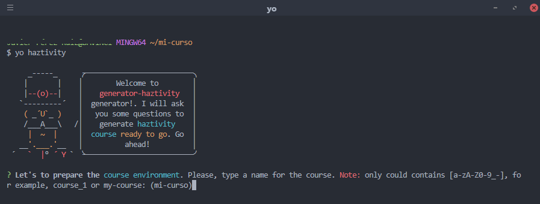
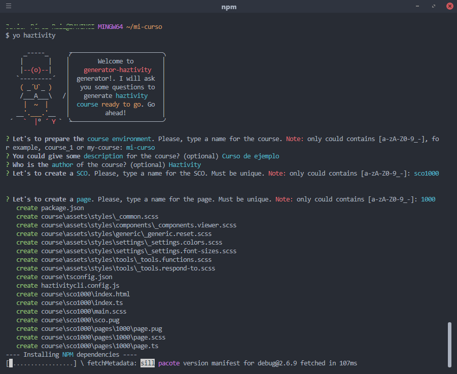
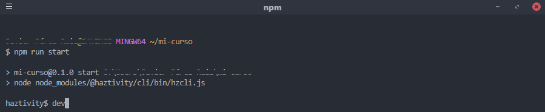

## ¿Qué es Haztivity?
Haztivity nace de la necesidad de reducir la cantidad de esfuerzo dedicado a la parte de programación en la creación de cursos formativos con el objetivo de que los desarrolladores de los cursos puedan centrar sus esfuerzos en la parte visual, interactiva y pedagógica.

Haztivity es un framework [SPA](https://es.wikipedia.org/wiki/Single-page_application) construido sobre [jQuery](https://jquery.com/) y con conocimientos comunes de HTML CSS y JS se pueden desarrollar cursos.

Uno de los principales objetivos de Haztivity es que el desarrollador de los cursos tenga que programar lo menos posible pero al mismo tiempo ofrecer herramientas avanzadas que permitan desarrollos más complejos sin tirar la casa por la ventana.

## Comenzando
<p class="tip tip--alert">Para poder comenzar se requieren conocimientos básicos de HTML, CSS y Javascript así como del uso de NodeJs y NPM</p>
<p class="tip">Por defecto Haztivity hace uso de <a href="https://www.typescriptlang.org/">Typescript</a>, <a href="https://sass-lang.com/">SASS</a> y <a href="https://pugjs.org">Pug</a>, no obstante, son opcionales y puede desarrollarse en JS(ES2017), CSS y HTML</p>

### Yeoman Generator
La forma más rápida de comenzar con Haztivity es utilizar [nuestro generador de Yeoman](https://github.com/haztivity/generator-haztivity/) que permite crear la estructura de un curso con el cual empezar ha desarrollar.

Para poder utilizar Yeoman es necesario que primero que tengas instalado [NodeJs](https://nodejs.org/en/), que puedes descargar [aquí](https://nodejs.org/en/download/current/)

Si no tienes instalado Yeoman, abre una consola y ejecuta
```bash
npm i -g yo
```

Para más información, consulta [la guía oficial de Yeoman](http://yeoman.io/learning/index.html)

A continuación instala nuestro generador ejecutando en la consola
```bash
npm i -g generator-haztivity
```

Para hacer uso del generador, crea una carpeta donde quieras tener el código del curso, navega en la consola hasta esa carpeta y ejecuta
```bash
cd directorio/de/mi-curso
yo haztivity
```
Se mostrará



Una vez introducidos los datos se instalarán todas las dependencias necesarias



Tras finalizar la instalación, ejecuta el comando
```bash
npm run start
```
con este comando se iniciará [hz-cli](), ejecuta el comando `dev`



y en el navegador abre [localhost:4444/course/sco1000/index.html](localhost:4444/course/sco1000/index.html)

<p class="tip tip--alert">sustituye <code>sco1000</code> por el nombre del sco que hayas introducido en el generador</p>

Y tienes la base para un curso de Haztivity.

<p class="tip">Actualmente nuestro generador genera el curso utilizando SASS, Typescript y Pug. En un futuro implementaremos opciones para elegir las tecnologías a utilizar</p>

## Navegadores
Actualmente Haztivity está preparado para trabajar en navegadores modernos y ofrece compatibilidad con IE10+.

<p class="tip">La compatibilidad es para @haztivity/core. Los recursos que se utilicen pueden no ser compatibles o requerir el uso de polyfills</p>