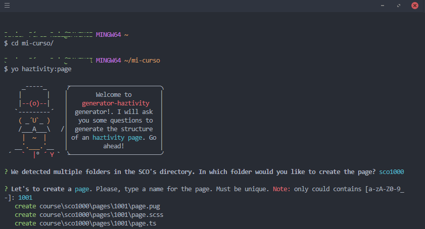

### Añadir páginas

Para crear una página nueva puedes utilizar [nuestro generador de Yeoman](https://github.com/haztivity/generator-haztivity/)

Abre la consola y vete a la carpeta del curso
```bash
cd directorio/de/mi-curso
yo haztivity:page
```

El generador preguntará en qué carpeta quieres incluir la página y el nombre que le quieres dar a la página



**Nota**: Ten en cuenta que nuestro generador de yeoman requiere de una estructura de carpetas concreta, si has definido tu propia estructuración el generador puede no funcionar correctamente.
